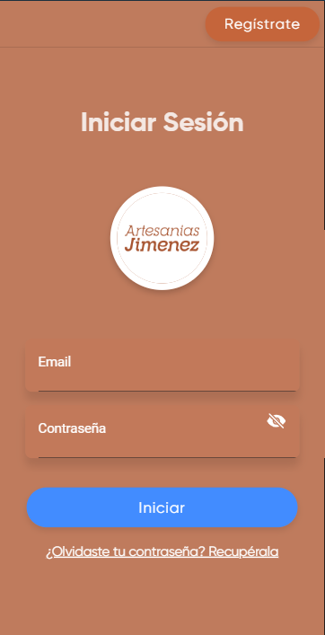
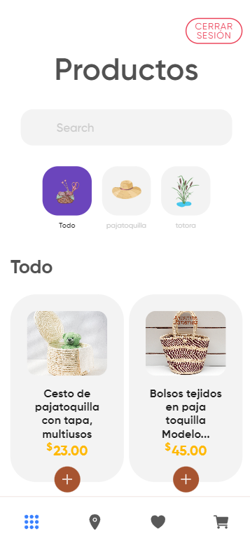
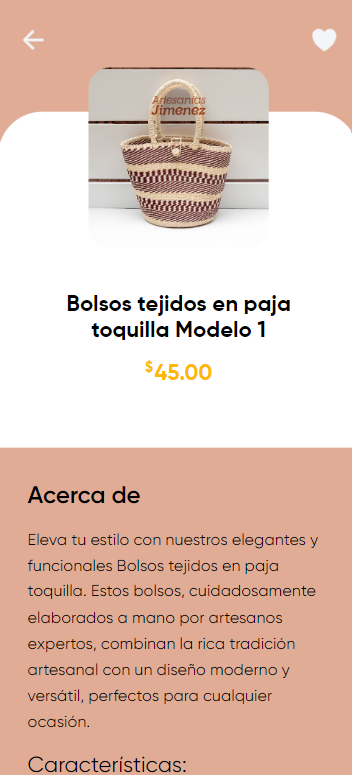

# ARTESANIAS JIMENEZ

**ARTESANIAS JIMENEZ** es una aplicación móvil desarrollada en Ionic que permite a los usuarios explorar y comprar artesanías tradicionales. La aplicación incluye funcionalidades como registro e inicio de sesión, búsqueda de productos, carrito de compras, generación de facturas en PDF, y mucho más.

## 🚀 Descargar APK

Puedes descargar la última versión del APK de la aplicación desde el siguiente enlace:

## 📱 Funcionalidades

### Pantalla de Inicio de Sesión y Registro
- Permite a los usuarios registrarse y acceder a sus cuentas.
- Incluye campos de entrada para el correo electrónico y la contraseña.
- Botón para iniciar sesión o registrarse.
- Opción para recuperar la contraseña en caso de olvido.

### Pantalla de Carga
- Muestra una animación de carga mientras la aplicación se está iniciando.

### Página Principal
- Muestra una lista de productos disponibles.
- Los usuarios pueden navegar por los productos y filtrarlos por categorías como paja toquilla y totora.
- Barra de búsqueda para productos específicos.

### Card Products
- Presenta los productos en formato de tarjetas.
- Cada tarjeta muestra una imagen, el nombre y el precio del producto.

### Búsqueda de Productos
- Permite a los usuarios buscar productos específicos utilizando una barra de búsqueda.

### Carrito de Compras
- Permite a los usuarios agregar productos que desean comprar.
- Funcionalidades para ver el contenido del carrito, modificar la cantidad de productos y proceder al pago.

### Detalle de los Productos
- Muestra información detallada sobre un producto seleccionado.
- Incluye su descripción, precio y opciones de compra.

### Mapa de Ubicación
- Integra la API de Google Maps para mostrar la ubicación del local físico de Artesanías Jiménez.
- Los usuarios pueden ver el mapa y obtener direcciones al local.

### Lista de Deseos
- Los usuarios pueden agregar productos que les interesan pero que no desean comprar inmediatamente.
- La lista es accesible desde la página principal y permite una fácil administración de los productos deseados.

### Generación de Facturas
- Utiliza la librería pdfmaker para crear facturas en formato PDF.
- Los usuarios pueden generar y descargar facturas después de realizar una compra.

## 🖼️ Capturas de Pantalla

A continuación, se muestran algunas capturas de pantalla de la aplicación:

### Pantalla de Inicio de Sesión

### Página Principal

### Detalle de Productos

## 🛠️ Tecnologías Utilizadas
- **Ionic Framework**: Para el desarrollo de la interfaz de usuario y la lógica de la aplicación.
- **Angular**: Framework para el desarrollo frontend.
- **Google Maps API**: Para la integración de mapas y localización.
- **pdfmaker**: Para la generación de facturas en formato PDF.
- **Firebase**: Para la autenticación de usuarios y almacenamiento en tiempo real.

